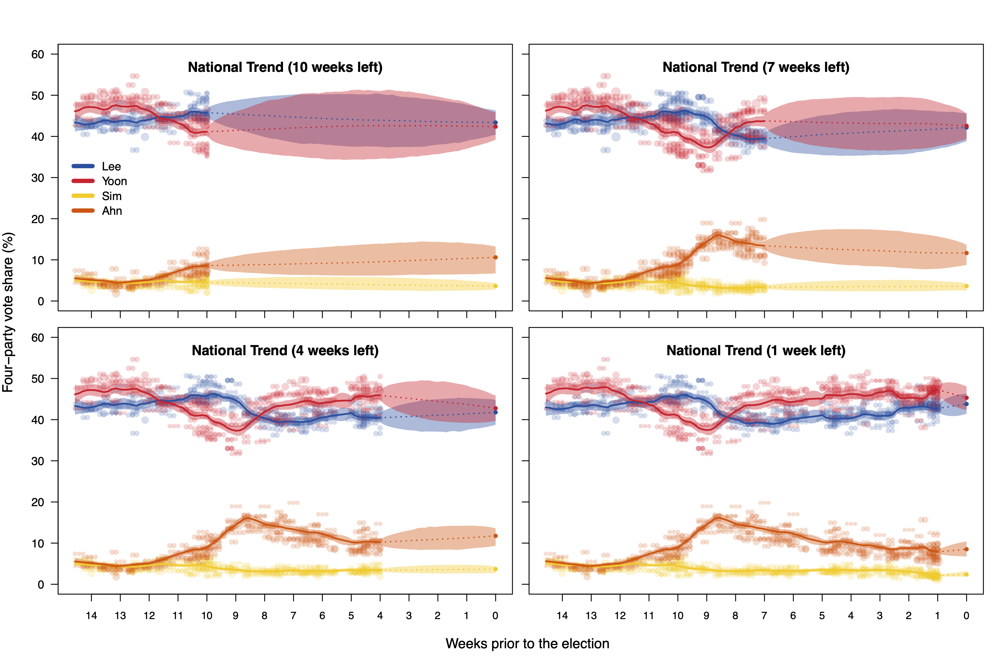

# 20th Presidential Election Forecast

Forecasting the four-party vote share of the 20th presidential election of the Republic of Korea

## Overview

-   Execute the `R` files in each folder in the order of the folders' name: `1a_data_generate` - `1b_summary` - `2_fundamental_model` - `3_poll_model`

-   `1a_data_generate` folder

    -   `save_RData.R` executes all three `R` files in the same folder. By result, it generates `pe.RData` file that saves historical presidential election results and 20th presidential election pre-election polls.

-   `1b_summary` folder

    -   Use `basic_plot.R` to plot summary of the historical two-party vote share of the Democratic Party. This plot is included in our manuscript as figure 1.

-   `2_fundamental_model` folder

    -   Run `run-fund-model.R` to conduct posterior sampling using Rstan. Rstan codes are in `fund-model-simple.stan` file.

    -   Use `fund-model-plot.R` to make summary plots from the posterior samples.

-   `3_poll_model` folder

    -   Run `run-poll-model.R` to conduct posterior sampling using Rstan. Rstan codes are in `poll-model.stan` file.

    -   Use `poll-model-plot.R` to make summary plots from the posterior samples.

## Reference

-   Seungwoo Kang and Hee-Seok Oh. (2024) [Forecasting South Korea's Presidential Election via Multiparty Dynamic Bayesian Modeling](https://doi.org/10.1016/j.ijforecast.2023.01.004). *International Journal of Forecasting*. **40**(1), pp. 124-141.
